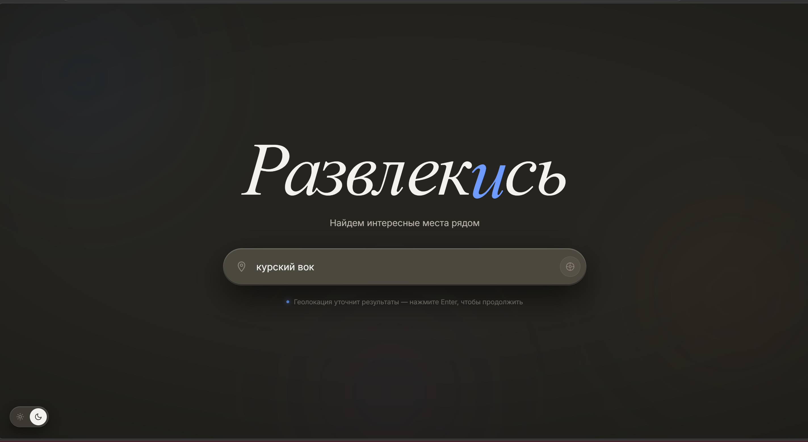
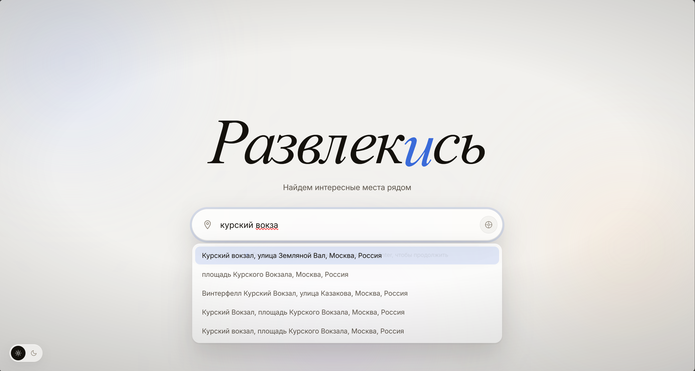

# Развлекись 🎯

Веб-сервис для поиска мест для отдыха рядом с вами: рестораны, кафе, бары, музеи, кинотеатры, парки и многое другое.

## Возможности

- **Поиск мест** — по адресу или геолокации, с фильтрацией по категориям (еда, бар, культура, кино, парки и т.д.)
- **Сортировка и фильтры** — по расстоянию, рейтингу, цене; только открытые, пешком, бюджетные
- **Карточки заведений** — адрес, рейтинг, цены, режим работы, фото
- **Открыть в Google Maps** — переход к месту в приложении или на сайте карт
- **Чат-ассистент** — ИИ-помощник на базе GigaChat, который знает про найденные места
- **Автодополнение адреса** — подсказки при вводе (Google Places Autocomplete)

## Презентация работы




В левом нижнем углу можно выбрать тему оформления.
Затем достаточно ввести адрес — автоподсказки помогут заполнить строку быстрее.
Также можно определить своё местоположение автоматически.


После поиска откроется список заведений, из которого можно выбрать подходящее.


Доступны фильтры для более точного подбора.


Сверху можно переключаться между типами заведений.


Если сложно определиться, на помощь придёт внутренний ассистент.

## Технологии

| Компонент | Стек |
|-----------|------|
| **Backend** | Python 3.11, FastAPI, httpx (async), Pydantic v2, uvicorn |
| **Frontend** | Vanilla HTML / CSS / JS (без фреймворков и бандлеров) |
| **Данные** | Google Places API (Nearby Search, Geocoding, Autocomplete) |
| **Чат** | GigaChat API (OAuth + Chat Completions) |
| **Инфра** | Docker Compose — nginx + backend |
| **CI/CD** | GitHub Actions — тесты → деплой по SSH |
| **HTTPS** | Let's Encrypt (Certbot) с российским SSL-сертификатом |

## Архитектура

```
Пользователь → nginx (порт 80/443)
                   ├── / → статика (index.html, styles.css, app.js)
                   └── /api/ → reverse proxy → backend (FastAPI, порт 8000)
                                                   ├── Google Places API
                                                   ├── Google Geocoding API
                                                   └── GigaChat API
```

## Быстрый старт

### 1. Клонирование

```bash
git clone https://github.com/DanilaTorubarov/KamalinGiga.git
cd KamalinGiga
```

### 2. Настройка окружения

Создайте файл `.env` в корне проекта:

```ini
GOOGLE_MAPS_API_KEY=ваш_ключ_google_maps
GIGACHAT_API_KEY=ваш_ключ_gigachat
GIGACHAT_SCOPE=GIGACHAT_API_PERS
```

### 3. Запуск (Docker)

```bash
docker compose up -d --build
```

Сервис будет доступен по адресу: http://localhost

### 4. Остановка

```bash
docker compose down
```

## Разработка

### Тесты

```bash
# Внутри Docker
docker compose exec backend pytest -v

# Локально
cd backend && pytest -v
```

### Запуск без Docker (только backend)

```bash
cd backend
pip install -r requirements.txt
uvicorn main:app --reload --port 8000
```

## API Endpoints

| Метод | Путь | Описание | Параметры |
|-------|------|----------|-----------|
| `POST` | `/api/geocode` | Геокодирование адреса | `{address: str}` |
| `GET` | `/api/places` | Поиск мест рядом | `lat, lng, address, category, radius, limit` |
| `POST` | `/api/chat` | Чат с GigaChat | `{message, history, context}` |
| `GET` | `/api/suggestions` | Автодополнение адреса | `q, lat, lng, radius, limit` |

> **Важно:** `/api/places` не поддерживает сортировку и фильтрацию на бэкенде — они выполняются на клиенте.

## Категории

| Параметр | Что ищет |
|----------|----------|
| `all` | Всё подряд |
| `rest` | Рестораны |
| `cafe` | Кафе |
| `bar` | Бары |
| `cult` | Музеи, театры, галереи |
| `cinema` | Кинотеатры |
| `fun` | Развлечения |
| `park` | Парки |

## CI/CD

При пуше в ветку `main` GitHub Actions автоматически:

1. Собирает Docker-образ и запускает тесты
2. При успехе — деплоит на сервер через SSH

Требуемые секреты репозитория: `ENV_DATA`, `DEPLOY_KEY`, `KNOWN_HOSTS`, `DEPLOY_USER`, `DEPLOY_HOST`, `DEPLOY_PATH`.

## HTTPS (Let's Encrypt)

Для продакшена поддерживается HTTPS с Let's Encrypt. Скрипты настройки:

```bash
scripts/setup-ssl.sh     # Получение сертификата и включение HTTPS
scripts/renew-ssl.sh     # Продление сертификата
```
